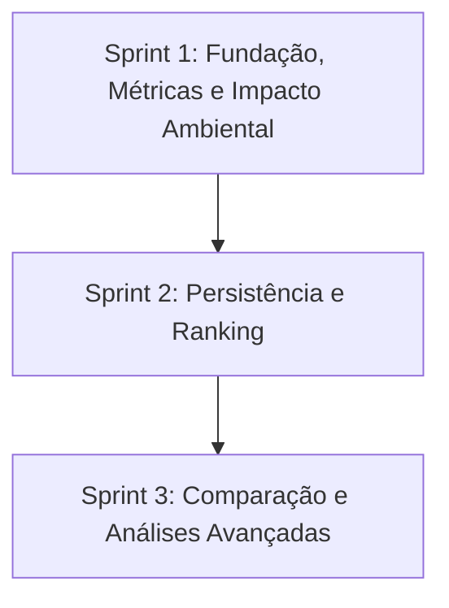

<p align ="center">

</p>

# <h1 align="center">GreenER</h1>

<p align="center">

  
  
  
  
  
  
  
  
  
  
  
  
  
  
</p>

---

## 📋 Índice

<details open>
  <summary><b>Sumário do Projeto</b></summary>

  <ul>
    <li>
      <details open>
        <summary><a href="#-descrição-do-projeto">1. Descrição do projeto</a></summary>
        <ul>
          <li><a href="#-relevância-do-projeto">1.1. Relevância do projeto</a></li>
          <li><a href="#-organização-de-pastas">1.2. Organização de pastas</a></li>
          <li><a href="#-como-iniciar-a-aplicação">1.3. Como iniciar a aplicação</a></li>
          <li><a href="#como-executar">1.4. Como executar</a></li>
          <li><a href="#-cronograma-de-evolução">1.5. Cronograma de evolução</a></li>
          <li><a href="#-funcionalidades">1.6. Funcionalidades</a></li>
          <li><a href="#-equipe">1.7. Equipe</a></li>
          <li><a href="#sprints">1.8. Sprints</a></li>
          <li><a href="#-especificações-do-projeto">1.9. Especificações do projeto</a></li>
        </ul>
      </details>
    </li>
  </ul>
</details>


## 📌 Descrição do Projeto
O greenER é uma aplicação web que monitora o consumo de CPU, memória, armazenamento e rede, estimando o impacto ambiental de serviços digitais com base na intensidade de carbono da região.

## 🌱 Relevância do Projeto
A plataforma relaciona o uso de recursos computacionais à eficiência energética e às emissões de CO₂ equivalente, apoiando análises sobre sustentabilidade e Green Computing. Os valores apresentados são estimativas para comparação entre serviços e não substituem medições físicas da infraestrutura.

---

## 📁 Organização de pastas

Itens identificados como **planejados** representam a estrutura prevista para as próximas etapas e ainda não existem no repositório.

```bash
greener/
├── .gitignore                        # Arquivos e pastas ignorados pelo Git
├── README.md                         # Documentação principal do projeto
│
├── backend/                          # API e regras de negócio da aplicação
│   ├── .dockerignore                 # Arquivos excluídos da imagem Docker
│   ├── .env.example                  # Modelo das variáveis de ambiente do backend
│   ├── .prettierignore               # Arquivos ignorados pelo Prettier
│   ├── Dockerfile                    # Configuração da imagem Docker do backend
│   ├── eslint.config.js              # Configuração do ESLint
│   ├── package.json                  # Dependências e scripts do backend
│   ├── package-lock.json             # Versões fixadas das dependências
│   ├── prettier.config.js            # Configuração do Prettier
│   ├── tsconfig.json                 # Configuração do TypeScript
│   └── src/                          # Código-fonte do backend
│       ├── app.ts                    # Configuração da aplicação Express
│       ├── server.ts                 # Inicialização do servidor
│       ├── db/                       # Acesso ao banco de dados (planejado)
│       │   └── connection.ts         # Conexão com o banco (planejado)
│       ├── integrations/             # Integrações com APIs externas (planejado)
│       │   ├── metrics-api.ts        # Integração com a API de métricas (planejado)
│       │   └── carbon-api.ts         # Integração com a API de carbono (planejado)
│       └── modules/                  # Módulos de funcionalidades (planejado)
│           └── coletas/              # Coleta e processamento de métricas (planejado)
│               ├── coletas.routes.ts       # Rotas de coleta (planejado)
│               ├── coletas.controller.ts   # Controle das requisições (planejado)
│               ├── coletas.service.ts      # Regras de negócio (planejado)
│               └── coletas.repository.ts   # Acesso e persistência (planejado)
│
├── compose.yaml                      # Serviços Docker (planejado)
│
├── database/                         # Banco de dados (planejado)
│   ├── README.md                     # Documentação do banco (planejado)
│   └── schema.sql                    # Tabelas e relacionamentos (planejado)
│
├── docs/                             # Documentação técnica (planejado)
│   ├── plano-de-entregas.md          # Planejamento das entregas (planejado)
│   ├── arquitetura.md                # Arquitetura do sistema (planejado)
│   ├── calculos.md                   # Cálculos realizados (planejado)
│   ├── api.md                        # APIs utilizadas (planejado)
│   └── sprints/                      # Documentação das sprints (planejado)
│       ├── sprint-1.md               # Sprint 1 (planejado)
│       ├── sprint-2.md               # Sprint 2 (planejado)
│       └── sprint-3.md               # Sprint 3 (planejado)
│
└── frontend/                         # Aplicação e interface do usuário
    ├── .dockerignore                 # Arquivos excluídos da imagem Docker
    ├── .env.example                  # Modelo das variáveis de ambiente do frontend
    ├── .prettierignore               # Arquivos ignorados pelo Prettier
    ├── components.json               # Configuração dos componentes shadcn/ui
    ├── Dockerfile                    # Configuração da imagem Docker do frontend
    ├── eslint.config.js              # Configuração do ESLint
    ├── index.html                    # Documento HTML de entrada do Vite
    ├── package.json                  # Dependências e scripts do frontend
    ├── package-lock.json             # Versões fixadas das dependências
    ├── prettier.config.js            # Configuração do Prettier
    ├── tsconfig.json                 # Configuração do TypeScript
    ├── vite.config.ts                # Configuração do Vite
    └── src/                          # Código-fonte do frontend
        ├── App.tsx                   # Componente principal da aplicação
        ├── index.css                 # Estilos globais
        ├── main.tsx                  # Ponto de entrada da aplicação
        ├── components/               # Componentes reutilizáveis
        │   └── ui/                   # Componentes de interface
        │       └── card.tsx
        ├── lib/                      # Utilitários compartilhados
        │   └── utils.ts
        ├── contexts/                 # Contextos para compartilhamento de estado (planejado)
        ├── hooks/                    # Hooks personalizados (planejado)
        ├── pages/                    # Páginas da aplicação (planejado)
        ├── providers/                # Provedores de contexto e dependências (planejado)
        └── services/                 # Comunicação com APIs e serviços externos (planejado)
```

---

### 🚀 Como iniciar a aplicação

Para executar o projeto localmente, siga os passos abaixo:

#### Pré-requisitos

 Antes de começar, certifique-se de ter instalado:

- [Docker](https://www.docker.com/)
- [Git](https://git-scm.com/)

## Como executar

### 1. Clone o repositório

```bash
git clone https://github.com/Team-Zero-DSM/GreenER.git
```

### 2. Acesse a pasta do projeto

```bash
cd greenER
```

### 3. Configure as variáveis de ambiente

Copie os arquivos .env.example para .env e ajuste os valores conforme necessário:
```bash
cp backend/.env.example backend/.env
cp frontend/.env.example frontend/.env
```

#### 4. Suba os containers

```bash
docker compose up --build
```

### 5. Acesse a aplicação
- Frontend: http://localhost:5173


---
## ⏳ Cronograma de Evolução

O projeto é desenvolvido em ciclos de 3 semanas, conforme o cronograma oficial.



---

### ✨ Funcionalidades

- 📊 Monitoramento de métricas dos serviços
- 🌱 Estimativa de impacto ambiental e emissão de CO₂e
- 🗺️ Visualização de serviços e suas regiões
- 📈 Histórico de métricas e resultados
- 🏆 Ranking de impacto ambiental
- 🔄 Comparação entre serviços e regiões
- 🔬 Simulação de execução em diferentes regiões
---

### 👥 Equipe

<body>
      <table>
         <thead>
            <th>Product Owner</th>
            <th>Scrum Master</th>
            <th>Dev Team</th>
            <th>Dev Team</th>
            <th>Dev Team</th>
         </thead>
         <tbody>
            <tr>
               <th><a href="https://github.com/henri-bueno"></a></th>
               <th><a href="https://github.com/pauloolivetti"></a></th>
               <th><a href="https://github.com/gabrielgomesfernandes"></a></th>
               <th><a href="https://github.com/vitorreis-dev"></a></th>
               <th><a href="https://github.com/phjsilva"></a></th>
            </tr>
         </tbody>
      </table>
</body>
--- 
### Sprints

| Sprint | Link                            | Início     | Entrega    | Status |
| ------ | ------------------------------- | ---------- | ---------- | ------ |
| 01     | <a href="#sprint1">Sprint 1</a> | 28/09/2026 | 19/10/2026 | 🔄     |
| 02     | <a href="#sprint2">Sprint 2</a> | 20/10/2026 | 09/11/2026 | ❌     |
| 03     | <a href="#sprint3">Sprint 3</a> | 10/11/2026 | 23/11/2026 | ❌     |

#### Legenda

✅ - Sprint concluída <br>
🔄 - Sprint em andamento <br>
❌ - Sprint não iniciada

---

## 📋 Especificações do Projeto

<details>
<summary><b>📌 Requisitos</b></summary>
<br>

<details>
<summary><b>Requisitos Funcionais</b></summary>
<br>

| **Código** | **Requisito Funcional** | **Descrição** |
| ---------- | ----------------------- | ------------- |
| RF01 | Descoberta de serviços | O sistema deve consultar o Agregador de Métricas para identificar os serviços disponíveis. |
| RF02 | Monitoramento dinâmico | O sistema deve se adaptar à inclusão, remoção, indisponibilidade ou restabelecimento de serviços durante a execução. |
| RF03 | Coleta de métricas por serviço | O sistema deve consultar periodicamente o endpoint `/metrics/{id_servico}` para cada serviço disponível. |
| RF04 | Variação das métricas | O sistema deve considerar que os valores retornados pela API podem apresentar valores distintos entre requisições. |
| RF05 | Detecção de indisponibilidade | O sistema deve identificar quando um serviço estiver indisponível ou não responder às requisições. |
| RF06 | Detecção de ausência de métricas | O sistema deve identificar quando um serviço estiver ativo, mas deixar de exportar métricas. |
| RF07 | Cálculo individual | O sistema deve calcular consumo energético e emissão de CO₂e para cada serviço monitorado. |
| RF08 | Indicadores agregados | O sistema deve calcular indicadores consolidados, como consumo total, emissão total, serviços ativos e serviços indisponíveis. |
| RF09 | Dashboard operacional | O sistema deve exibir, em um dashboard operacional, o status, as métricas, a localização e o impacto ambiental de cada serviço monitorado. |
| RF10 | Histórico de coletas | O sistema deve armazenar o histórico das coletas realizadas para permitir análise temporal. |
| RF11 | Atualização contínua | A interface deve atualizar periodicamente os dados apresentados, refletindo as alterações identificadas nas informações dos serviços monitorados. |
| RF12 | Localização dos serviços | O sistema deve exibir país, região e, quando disponível, cidade onde o serviço está hospedado. |
| RF13 | Visualização geográfica | O sistema deve apresentar a posição aproximada dos serviços em um mapa, utilizando latitude e longitude fornecidas pela API. |
| RF14 | Ranking de impacto | O sistema deve apresentar ranking dos serviços por maior consumo energético ou maior emissão de CO₂e. |
| RF15 | Comparação entre serviços | O sistema deve permitir comparar métricas e impacto ambiental entre dois ou mais serviços. |

</details>

<br>

<details>
<summary><b>Requisitos Não Funcionais</b></summary>
<br>

| **Código** | **Requisito Não Funcional** | **Descrição** |
| ---------- | --------------------------- | ------------- |
| RNF01 | Usabilidade e responsividade | A interface deve ser clara, intuitiva e adaptável para desktop e dispositivos móveis. |
| RNF02 | Atualização periódica | As informações exibidas devem ser atualizadas automaticamente em intervalos configurados pela aplicação, sem necessidade de recarregamento da página. |
| RNF03 | Desempenho | O dashboard deve apresentar tempo de resposta compatível com a navegação e consulta contínua dos dados monitorados. |
| RNF04 | Tolerância a falhas | A indisponibilidade temporária de serviços monitorados ou APIs externas não deve interromper o funcionamento geral do sistema. |
| RNF05 | Segurança | O acesso às áreas protegidas do sistema deve ser controlado por autenticação JWT implementada no backend. |
| RNF06 | Persistência de dados | O histórico de coletas deve ser armazenado em PostgreSQL, garantindo a integridade e a persistência das informações. |
| RNF07 | Containerização | Toda a aplicação deve ser executável através de containers Docker conforme as restrições do projeto. |
| RNF08 | Documentação técnica | O projeto deve possuir documentação de arquitetura, banco de dados, endpoints, instalação e execução. |
| RNF09 | Manutenibilidade | O código deve seguir organização modular, separando responsabilidades entre frontend, backend, serviços e banco de dados. |
| RNF10 | Adaptabilidade | A solução deve ser capaz de monitorar novos serviços identificados pela API sem necessidade de alteração manual no sistema. |
| RNF11 | Rastreabilidade | User Stories, tarefas e entregas devem estar vinculadas aos requisitos definidos no backlog do projeto. |
| RNF12 | Gestão Ágil | O projeto deve manter backlog priorizado, registro das sprints, reviews e planejamento contínuo conforme a metodologia Scrum adotada pela equipe. |

</details>

</details>

<details>
<summary><b>👥 User Stories</b></summary>
<br>

<details>
<summary><b>📡 Épico 1 — Monitoramento dos Serviços</b></summary>
<br>

#### US01 — Descoberta de serviços

**Como** usuário da plataforma,  
**quero** que o sistema identifique automaticamente os serviços disponíveis,  
**para** acompanhar os serviços monitorados sem necessidade de cadastrá-los manualmente.

**Prioridade:** Alta  

**Requisitos relacionados:** RF01, RNF10

**Critérios de aceitação:**

- O sistema deve consultar o Agregador de Métricas para obter os serviços disponíveis.
- Os serviços retornados devem ser identificados pela aplicação.
- Novos serviços disponibilizados pelo agregador devem ser reconhecidos automaticamente.

#### US02 — Monitoramento dinâmico dos serviços

**Como** usuário da plataforma,  
**quero** que o sistema reconheça alterações na disponibilidade dos serviços,  
**para** que o monitoramento represente o estado atual do ambiente.

**Prioridade:** Alta  

**Requisitos relacionados:** RF02, RNF10

**Critérios de aceitação:**

- Novos serviços devem ser identificados durante a execução.
- Serviços removidos devem deixar de ser considerados disponíveis.
- Serviços indisponíveis devem ter seu estado atualizado.
- Serviços restabelecidos devem voltar a ser considerados disponíveis.

#### US03 — Coleta periódica de métricas

**Como** usuário da plataforma,  
**quero** que as métricas dos serviços sejam coletadas periodicamente,  
**para** acompanhar o comportamento dos serviços monitorados.

**Prioridade:** Alta  

**Requisitos relacionados:** RF03, RF04

**Critérios de aceitação:**

- O sistema deve consultar o endpoint `/metrics/{id_servico}` para cada serviço disponível.
- As consultas devem ocorrer periodicamente.
- Os valores retornados em cada coleta devem ser processados pela aplicação.
- Alterações nos valores das métricas devem ser consideradas nas novas coletas.

</details>

<details>
<summary><b>⚠️ Épico 2 — Detecção de Problemas</b></summary>
<br>

#### US04 — Identificação de indisponibilidade

**Como** usuário da plataforma,  
**quero** identificar quando um serviço estiver indisponível,  
**para** saber quais serviços não estão respondendo normalmente.

**Prioridade:** Alta  

**Requisitos relacionados:** RF05, RNF04

**Critérios de aceitação:**

- Falhas ou ausência de resposta nas consultas devem ser identificadas.
- O serviço deve ser sinalizado como indisponível.
- A indisponibilidade de um serviço não deve interromper o monitoramento dos demais.

#### US05 — Identificação de ausência de métricas

**Como** usuário da plataforma,  
**quero** identificar quando um serviço estiver ativo, mas não disponibilizar métricas,  
**para** diferenciar ausência de dados de indisponibilidade do serviço.

**Prioridade:** Alta  

**Requisitos relacionados:** RF06, RNF04

**Critérios de aceitação:**

- O sistema deve verificar se o serviço permanece disponível no Agregador de Métricas.
- O sistema deve identificar quando o serviço não estiver disponibilizando métricas.
- A ausência de métricas deve possuir uma identificação distinta da indisponibilidade do serviço.

</details>

<details>
<summary><b>🌱 Épico 3 — Impacto Ambiental</b></summary>
<br>

#### US06 — Cálculo do impacto individual

**Como** usuário da plataforma,  
**quero** visualizar o consumo energético e a emissão estimada de CO₂e de cada serviço,  
**para** compreender seu impacto ambiental individual.

**Prioridade:** Alta  

**Requisitos relacionados:** RF07

**Critérios de aceitação:**

- Cada serviço monitorado deve possuir um cálculo de consumo energético.
- Cada serviço monitorado deve possuir um cálculo de emissão de CO₂e.
- Os cálculos devem utilizar os dados obtidos durante o monitoramento.

#### US07 — Indicadores ambientais consolidados

**Como** usuário da plataforma,  
**quero** visualizar indicadores consolidados do ambiente monitorado,  
**para** compreender sua situação geral.

**Prioridade:** Média  

**Requisitos relacionados:** RF08

**Critérios de aceitação:**

- O sistema deve apresentar o consumo energético total.
- O sistema deve apresentar a emissão total de CO₂e.
- O sistema deve apresentar a quantidade de serviços ativos.
- O sistema deve apresentar a quantidade de serviços indisponíveis.

</details>

<details>
<summary><b>📊 Épico 4 — Dashboard e Visualização</b></summary>
<br>

#### US08 — Dashboard operacional

**Como** usuário da plataforma,  
**quero** visualizar as principais informações dos serviços em um dashboard,  
**para** acompanhar o ambiente monitorado em um único local.

**Prioridade:** Alta  

**Requisitos relacionados:** RF09, RNF01, RNF03

**Critérios de aceitação:**

- O dashboard deve apresentar o status dos serviços.
- O dashboard deve apresentar as métricas disponíveis.
- O dashboard deve apresentar a localização dos serviços.
- O dashboard deve apresentar os indicadores de impacto ambiental.

#### US09 — Atualização automática do dashboard

**Como** usuário da plataforma,  
**quero** que os dados do dashboard sejam atualizados automaticamente,  
**para** acompanhar as alterações do ambiente sem recarregar a página.

**Prioridade:** Alta  

**Requisitos relacionados:** RF11, RNF02

**Critérios de aceitação:**

- Os dados devem ser atualizados periodicamente.
- A atualização não deve exigir recarregamento manual da página.
- O intervalo de atualização deve ser definido pela aplicação.
- O dashboard deve refletir os dados obtidos na atualização mais recente.

</details>

<details>
<summary><b>📈 Épico 5 — Histórico e Localização</b></summary>
<br>

#### US10 — Consulta do histórico de coletas

**Como** usuário da plataforma,  
**quero** consultar o histórico das coletas realizadas,  
**para** analisar a evolução das métricas e indicadores ao longo do tempo.

**Prioridade:** Média  

**Requisitos relacionados:** RF10, RNF06

**Critérios de aceitação:**

- As coletas realizadas devem ser armazenadas.
- Os dados devem permanecer associados ao respectivo serviço.
- Deve ser possível consultar dados referentes a diferentes momentos de coleta.

#### US11 — Visualização da localização dos serviços

**Como** usuário da plataforma,  
**quero** visualizar a localização dos serviços monitorados,  
**para** relacionar sua localização aos dados apresentados.

**Prioridade:** Média  

**Requisitos relacionados:** RF12

**Critérios de aceitação:**

- O sistema deve apresentar o país do serviço.
- O sistema deve apresentar a região do serviço.
- O sistema deve apresentar a cidade quando essa informação estiver disponível.

#### US12 — Visualização geográfica dos serviços

**Como** usuário da plataforma,  
**quero** visualizar os serviços em um mapa,  
**para** compreender sua distribuição geográfica.

**Prioridade:** Média  

**Requisitos relacionados:** RF13

**Critérios de aceitação:**

- O sistema deve apresentar os serviços que possuírem latitude e longitude disponíveis.
- A posição apresentada deve utilizar as coordenadas fornecidas pela API.
- A ausência de coordenadas de um serviço não deve impedir a visualização das demais informações.

</details>

<details>
<summary><b>🔎 Épico 6 — Análise e Comparação</b></summary>
<br>

#### US13 — Ranking de impacto

**Como** usuário da plataforma,  
**quero** ordenar os serviços por consumo energético ou emissão de CO₂e,  
**para** analisar os diferentes níveis de impacto ambiental.

**Prioridade:** Média  

**Requisitos relacionados:** RF14

**Critérios de aceitação:**

- Deve ser possível ordenar os serviços por consumo energético.
- Deve ser possível ordenar os serviços por emissão de CO₂e.
- Os valores utilizados no ranking devem corresponder ao período analisado.

#### US14 — Comparação entre serviços

**Como** usuário da plataforma,  
**quero** comparar dois ou mais serviços,  
**para** analisar suas métricas e indicadores ambientais.

**Prioridade:** Média  

**Requisitos relacionados:** RF15

**Critérios de aceitação:**

- O usuário deve conseguir selecionar dois ou mais serviços.
- Os serviços devem ser comparados considerando o mesmo período.
- A comparação deve apresentar métricas e indicadores ambientais relevantes.

</details>

<details>
<summary><b>🔐 Épico 7 — Acesso e Segurança</b></summary>
<br>

#### US15 — Autenticação de usuários

**Como** usuário autorizado,  
**quero** me autenticar na plataforma,  
**para** acessar os recursos que exigem autorização.

**Prioridade:** Alta  

**Requisitos relacionados:** RNF05

**Critérios de aceitação:**

- A autenticação deve ser realizada pelo backend.
- O sistema deve utilizar JWT após uma autenticação válida.
- Recursos protegidos não devem ser acessíveis por usuários não autenticados.
- O controle de acesso deve ser realizado no backend, não apenas na interface.

#### US16 — Continuidade do monitoramento diante de falhas

**Como** usuário da plataforma,  
**quero** que uma falha isolada não interrompa o funcionamento do sistema,  
**para** continuar acompanhando os demais serviços monitorados.

**Prioridade:** Alta  

**Requisitos relacionados:** RNF04

**Critérios de aceitação:**

- A indisponibilidade de um serviço não deve interromper o monitoramento dos demais.
- Falhas em APIs externas não devem encerrar a aplicação.
- Falhas identificadas devem ser tratadas e sinalizadas adequadamente.
- O sistema deve permanecer disponível para as demais funcionalidades não afetadas.

</details>

<br>

### ✅ Definition of Done — Geral

Uma User Story será considerada concluída quando:

- A funcionalidade estiver implementada.
- Todos os critérios de aceitação da história forem atendidos.
- Os testes necessários tiverem sido realizados.
- A integração com os componentes envolvidos estiver validada.
- Não houver erros conhecidos que impeçam o funcionamento da funcionalidade.
- O código estiver integrado à versão correspondente do projeto.
- A documentação for atualizada quando a alteração exigir documentação.
- A implementação estiver disponível para validação pela equipe.

</details>

<details>
<summary><b>📦 Product Backlog</b></summary>
<br>

| **ID** | **Épico**                  | **Item / Nome**                                | **Prioridade** | **RF/RNF vinculados** | **Status** |
| ------ | -------------------------- | ---------------------------------------------- | -------------- | --------------------- | ---------- |
| US01   | Monitoramento dos Serviços | Descoberta de serviços                         | Alta           | RF01, RNF10           | ❌          |
| US03   | Monitoramento dos Serviços | Coleta periódica de métricas                   | Alta           | RF03, RF04            | ❌          |
| US04   | Detecção de Problemas      | Identificação de indisponibilidade             | Alta           | RF05, RNF04           | ❌          |
| US05   | Detecção de Problemas      | Identificação de ausência de métricas          | Alta           | RF06, RNF04           | ❌          |
| US02   | Monitoramento dos Serviços | Monitoramento dinâmico dos serviços            | Alta           | RF02, RNF10           | ❌          |
| US06   | Impacto Ambiental          | Cálculo do impacto individual                  | Alta           | RF07                  | ❌          |
| US07   | Impacto Ambiental          | Indicadores ambientais consolidados            | Média          | RF08                  | ❌          |
| US08   | Dashboard e Visualização   | Dashboard operacional                          | Alta           | RF09, RNF01, RNF03    | ❌          |
| US09   | Dashboard e Visualização   | Atualização automática do dashboard            | Alta           | RF11, RNF02           | ❌          |
| US10   | Histórico e Localização    | Consulta do histórico de coletas               | Média          | RF10, RNF06           | ❌          |
| US11   | Histórico e Localização    | Visualização da localização dos serviços       | Média          | RF12                  | ❌          |
| US12   | Histórico e Localização    | Visualização geográfica dos serviços           | Média          | RF13                  | ❌          |
| US13   | Análise e Comparação       | Ranking de impacto                             | Média          | RF14                  | ❌          |
| US14   | Análise e Comparação       | Comparação entre serviços                      | Média          | RF15                  | ❌          |
| US15   | Acesso e Segurança         | Autenticação de usuários                       | Alta           | RNF05                 | ❌          |
| US16   | Acesso e Segurança         | Continuidade do monitoramento diante de falhas | Alta           | RNF04                 | ❌          |

<br>

**Legenda**

❌ — Não iniciado  
🔄 — Em andamento  
✅ — Concluído

</details>

<details>
<summary><b>📝 Padrão de Commits</b></summary>

Para garantir a rastreabilidade com o **GitHub Projects** e as **Issues**, adotamos os seguintes padrões:

### Commits

As mensagens devem referenciar o ID da Issue com `#`:

- `tipo(#id_issue): descrição clara`
- _Exemplo:_ `feat(#1): implementar hash de senha no cadastro`

**Tipos permitidos:**

| Tipo | Descrição |
| :--- | :--- |
| **`feat`** | Adição de um novo recurso ou funcionalidade. |
| **`fix`** | Correção de um erro ou bug. |
| **`docs`** | Alterações apenas na documentação (ex: README). |
| **`refactor`** | Mudanças na estrutura do código sem alterar seu comportamento. |
| **`cleanup`** | Limpeza de código (remover comentários ou trechos inúteis). |

</details>


