# Arquitetura do Software — GreenER

## 1. Visão Geral

O GreenER é uma plataforma web responsável por monitorar aplicações de software,
coletar métricas de infraestrutura e estimar seu impacto ambiental por meio do
cálculo de consumo energético e emissão aproximada de CO₂ equivalente (CO₂e).

A aplicação utiliza duas APIs externas fornecidas pelo projeto:

- **Greener Metrics Aggregator API**
  - Descoberta dos serviços disponíveis;
  - Coleta das métricas de CPU, memória, disco e rede;
  - Obtenção da localização dos serviços.

- **Greener Carbon Intensity API**
  - Consulta da intensidade de carbono correspondente à região onde o serviço
    está hospedado.

O backend é responsável por:

- consultar as APIs externas;
- validar os dados recebidos;
- monitorar os serviços;
- executar as coletas periodicamente;
- calcular consumo energético;
- calcular emissão estimada de CO₂e;
- armazenar o histórico das coletas;
- disponibilizar os dados para o frontend através de uma API REST.

O frontend não acessa diretamente as APIs externas.

---

# 2. Tecnologias Utilizadas

## Frontend

- React;
- TypeScript;
- Vite;
- Tailwind CSS;
- shadcn/ui.

## Backend

- Node.js;
- TypeScript;
- Express;
- Zod;
- `pg`;
- CORS;
- dotenv;
- bcrypt;
- JSON Web Token — JWT.

## Banco de Dados

- PostgreSQL;
- SQL explícito;
- sem utilização de ORM.

## Infraestrutura

- Docker;
- Docker Compose.

---

# 3. Visão Geral da Arquitetura

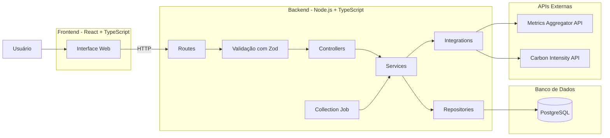

O backend funciona como intermediário entre o frontend, o banco de dados e as
APIs externas.

---

# 4. Organização Geral do Projeto

A estrutura inicial proposta para o projeto é:

```text
greener/
│
├── README.md
├── .env.example
├── compose.yaml
│
├── frontend/
│   ├── Dockerfile
│   └── src/
│       ├── components/
│       ├── pages/
│       ├── services/
│       ├── hooks/
│       ├── contexts/
│       └── providers/
│
├── backend/
│   ├── Dockerfile
│   └── src/
│       ├── app.ts
│       ├── server.ts
│       │
│       ├── db/
│       │   └── connection.ts
│       │
│       ├── integrations/
│       │   ├── metrics-api.ts
│       │   ├── metrics-api.schema.ts
│       │   ├── carbon-api.ts
│       │   └── carbon-api.schema.ts
│       │
│       ├── jobs/
│       │   └── collection.job.ts
│       │
│       ├── modules/
│       │   │
│       │   ├── collections/
│       │   │   ├── collections.service.ts
│       │   │   ├── collections.repository.ts
│       │   │
│       │   │   
│       │   │
│       │   │
│       │   ├── services/
│       │   │   ├── services.routes.ts
│       │   │   ├── services.controller.ts
│       │   │   ├── services.service.ts
│       │   │   ├── services.repository.ts
│       │   │   └── services.schema.ts
│       │   │
│       │   └── monitoring-settings/
│       │       ├── monitoring-settings.routes.ts
│       │       ├── monitoring-settings.controller.ts
│       │       ├── monitoring-settings.service.ts
│       │       ├── monitoring-settings.repository.ts
│       │       └── monitoring-settings.schema.ts
│       │
│       └── shared/
│           ├── errors/
│           ├── middlewares/
│           └── types/
│
├── database/
│   └── schema.sql
│   └── arquitetura.md
│   
└── docs/
    ├── arquitetura.md
    ├── calculos.md
    ├── api.md
    ├── plano-de-entregas.md
    └── sprints/
```

A estrutura poderá evoluir conforme novas funcionalidades forem implementadas.

Não devem ser criadas pastas ou abstrações sem uma responsabilidade real na
aplicação.

---

# 5. Organização do Backend

O backend é organizado em diferentes responsabilidades:

```text
HTTP
 ↓
Routes
 ↓
Validação
 ↓
Controllers
 ↓
Services
 ↓
Repositories / Integrations
 ↓
PostgreSQL / APIs externas
```

Cada camada possui uma responsabilidade específica.

---


# 7. Validação com Zod

O Zod é utilizado para validar dados em tempo de execução.

O TypeScript realiza validação de tipos durante o desenvolvimento, porém não
garante que dados recebidos através da rede tenham realmente o formato esperado.

Por esse motivo, o Zod é utilizado para validar:

- `body`;
- `params`;
- `query parameters`;
- respostas recebidas das APIs externas.

---

## 7.1 Validação das requisições

Exemplo de fluxo:

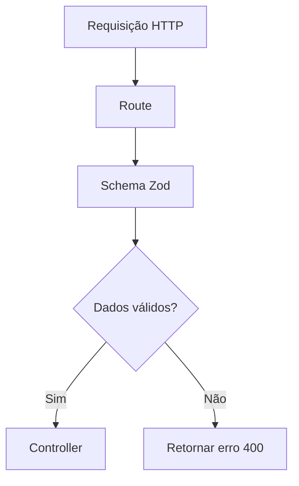

Exemplo:

```text
PATCH /monitoring-settings

Body:
{
    "collectionIntervalSeconds": 30
}
```

Antes do controller receber os dados:

```text
Request
   ↓
Zod
   ↓
Dados válidos
   ↓
Controller
```

---

# 8. Validação das APIs Externas

Os dados retornados pelas APIs externas também devem ser considerados dados não
confiáveis até serem validados.

Por exemplo:

```text
Metrics API
    ↓
fetch
    ↓
JSON
    ↓
Zod
    ↓
objeto validado
    ↓
Service
```

Fluxo:

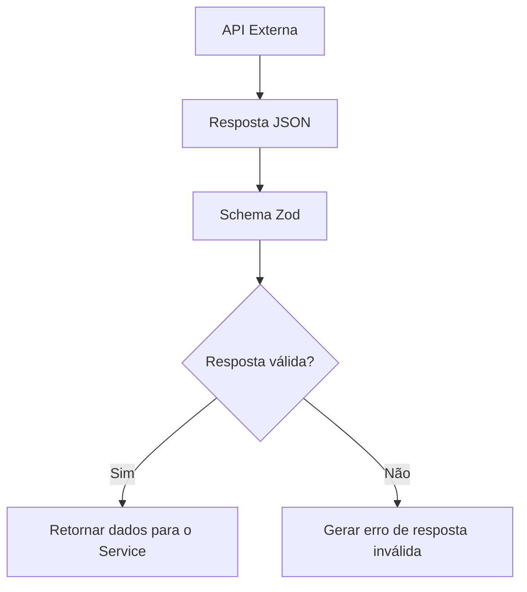

Isso evita que uma mudança inesperada na API externa gere dados incorretos
dentro da aplicação.

---

# 9. Controllers

Os controllers representam a camada HTTP da aplicação.

Responsabilidades:

- receber dados já validados;
- acessar parâmetros da requisição;
- chamar o service correspondente;
- definir status HTTP;
- retornar respostas JSON.

Exemplo:

```text
Route
  ↓
Controller
  ↓
Service
```

O controller não deve:

```text
❌ executar SQL
❌ acessar PostgreSQL diretamente
❌ fazer cálculos ambientais
❌ executar fetch para API externa
❌ implementar regras de negócio
```

---

# 10. Services

Os services concentram as regras de negócio e a coordenação das operações.

Eles podem utilizar:

- repositories;
- integrations;
- outros componentes necessários à regra de negócio.

Exemplo:

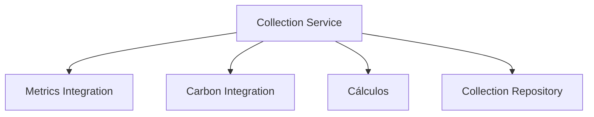

Um service pode, por exemplo:

1. solicitar as métricas de um serviço;
2. obter a intensidade de carbono;
3. calcular potência;
4. calcular energia;
5. calcular CO₂e;
6. criar uma coleta;
7. solicitar ao repository que salve a coleta.

---

# 11. Repositories

Os repositories concentram todo o acesso ao PostgreSQL.

Exemplo:

```text
Service
   ↓
Repository
   ↓
pg
   ↓
PostgreSQL
```

Os repositories são responsáveis por:

- executar `SELECT`;
- executar `INSERT`;
- executar `UPDATE`;
- executar `DELETE`, quando necessário;
- realizar agregações;
- realizar consultas históricas;
- executar consultas parametrizadas.

Exemplo conceitual:

```text
CollectionRepository

save()

findById()

findByServiceId()

findByPeriod()

findLatestByServiceId()
```

Os repositories não devem:

```text
❌ chamar API externa
❌ calcular CO₂e
❌ controlar intervalo de monitoramento
❌ tratar requisição HTTP
❌ decidir regras de negócio
```

---

# 12. Integrations

A pasta `integrations` concentra a comunicação com sistemas externos.

```text
integrations/
├── metrics-api.ts
├── metrics-api.schema.ts
├── carbon-api.ts
└── carbon-api.schema.ts
```

A ideia é impedir que diferentes módulos da aplicação executem `fetch`
diretamente.

---

# 13. Metrics API Integration

O arquivo:

```text
metrics-api.ts
```

é responsável pela comunicação com a Greener Metrics Aggregator API.

Principais operações:

```text
GET /services

GET /metrics/{service_id}
```

Conceitualmente:

```text
getServices()

getMetrics(serviceId)
```

O endpoint `/services` permite descobrir quais serviços existem atualmente no
ambiente monitorado.

O endpoint `/metrics/{service_id}` fornece as métricas de um serviço específico.

---

# 14. Carbon API Integration

O arquivo:

```text
carbon-api.ts
```

é responsável pela comunicação com a Greener Carbon Intensity API.

A API recebe o código da região do serviço.

Exemplo:

```text
br-sudeste
```

e retorna dados como:

```text
carbon_intensity_gco2e_per_kwh
```

Fluxo:

```text
region_code
     ↓
Carbon Integration
     ↓
Carbon API
     ↓
Zod
     ↓
intensidade de carbono
```

---

# 15. Timeout das APIs Externas

As chamadas para APIs externas possuem timeout para evitar que uma chamada que
não responde bloqueie indefinidamente o processo de monitoramento.

Inicialmente foi definido:

```text
Timeout: 8 segundos
```

O timeout de 8 segundos é uma decisão técnica da equipe.

Fluxo:

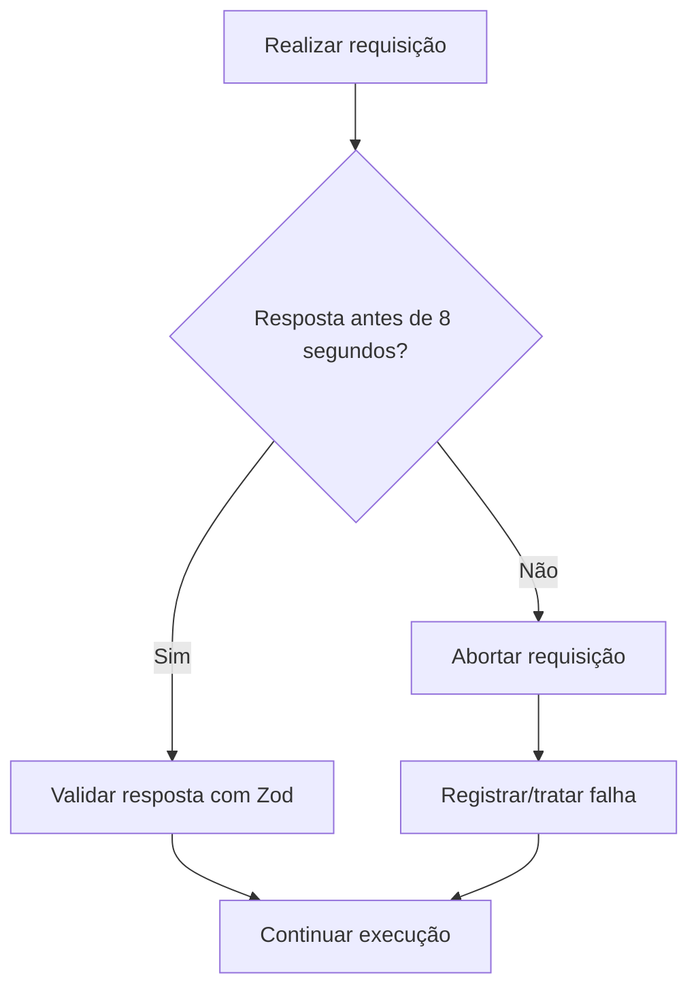

Uma falha em uma chamada externa não deve encerrar toda a aplicação.

---

# 16. Collection Job

O `collection.job.ts` é responsável por iniciar periodicamente o processo de
monitoramento.

O Job não deve implementar as regras de negócio da coleta.

Sua função é determinar **quando** o processo deve iniciar.

As regras sobre **como** executar a coleta ficam no service.

```text
Collection Job
      ↓
Collection Service
```

---

# 17. Configuração do Intervalo

O intervalo utilizado para iniciar as rodadas de monitoramento poderá ser
armazenado no PostgreSQL.

Exemplo conceitual:

```text
monitoring_settings

collection_interval_seconds
```

Fluxo:

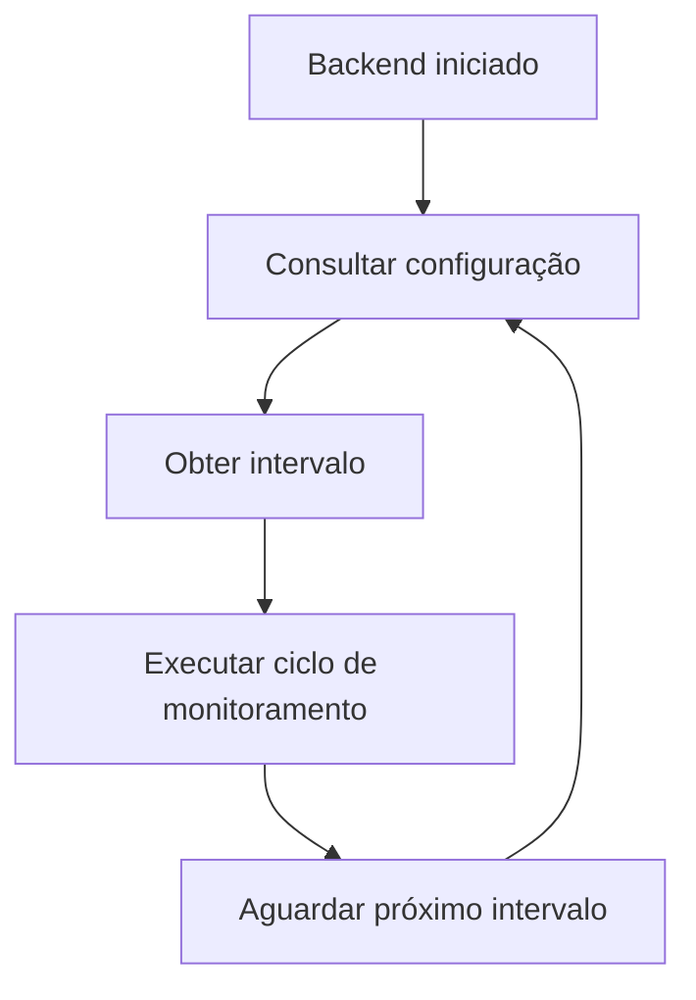

Armazenar essa configuração no banco é uma decisão técnica da equipe.

---

# 18. Diferença entre os Intervalos

Existem dois conceitos que não devem ser confundidos.

## Intervalo do Job

Define com que frequência o GreenER inicia uma nova rodada de monitoramento.

Exemplo:

```text
30 segundos
```

Representação:

```text
Rodada
  ↓
30 segundos
  ↓
Rodada
  ↓
30 segundos
  ↓
Rodada
```

---

## Collection Interval da API

A Metrics API retorna:

```text
collection_interval_seconds
```

junto das métricas.

Exemplo:

```json
{
    "collection_interval_seconds": 27,
    "metrics": {
        "cpu_percent": 62.67,
        "memory_gb": 3.17,
        "disk_gb": 19.26,
        "network_gb": 0.45
    }
}
```

Esse valor representa o intervalo relacionado às métricas retornadas e é
utilizado no cálculo da energia daquela coleta.

Por exemplo:

```text
27 segundos
    ↓
27 / 3600
    ↓
0,0075 horas
```

Esse valor pode então ser utilizado na fórmula de energia.

O `collection_interval_seconds` retornado pela API não deve ser confundido
automaticamente com o intervalo utilizado pelo Job.

---

# 19. Descoberta dos Serviços

Antes de realizar as coletas, o GreenER consulta:

```text
GET /services
```

para obter a situação atual do ambiente.

Isso permite detectar:

- novos serviços;
- serviços removidos;
- serviços que retornaram;
- alterações no ambiente monitorado.

Fluxo:

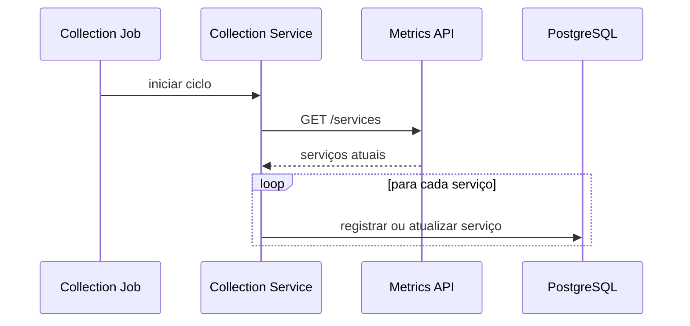

A API externa representa o estado atual dos serviços monitorados.

O banco mantém os dados necessários para histórico e utilização pela aplicação.

---

# 20. Fluxo Geral de Monitoramento

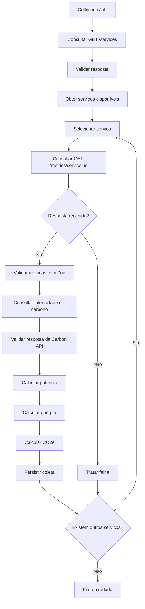

A falha na coleta de um serviço não deve impedir a coleta dos demais.

---

# 21. Collection Service

O Collection Service coordena o caso de uso de uma coleta.

Fluxo simplificado:

```text
collect(service)
    ↓
buscar métricas
    ↓
validar métricas
    ↓
obter intensidade de carbono
    ↓
validar intensidade
    ↓
calcular potência
    ↓
calcular energia
    ↓
calcular CO₂e
    ↓
montar coleta
    ↓
persistir
```

Ele atua como o coordenador da operação.

---

# 22. Cálculo de Potência

A potência estimada considera:

```text
Potência CPU
+
Potência Memória
+
Potência Disco
+
Potência Rede
```

Fórmula:

```text
Potência Estimada (W) =
    Potência CPU
    + Potência Memória
    + Potência Disco
    + Potência Rede
```

---

# 23. Potência da CPU

```text
Potência CPU (W) =

(Uso de CPU (%) / 100)

×

Potência Máxima da CPU (W)
```

---

# 24. Potência da Memória

```text
Potência Memória (W) =

Memória Utilizada (GB)

×

Fator de Consumo da Memória (W/GB)
```

---

# 25. Potência de Disco

```text
Potência Disco (W) =

Uso de Disco (GB)

×

Fator de Consumo do Disco (W/GB)
```

---

# 26. Potência de Rede

```text
Potência Rede (W) =

Tráfego de Rede (GB)

×

Fator de Consumo da Rede (W/GB)
```

---

# 27. Cálculo de Energia

Depois de calcular a potência:

```text
Energia (kWh) =

Potência Estimada (W)

×

Tempo de Coleta (h)

/

1000
```

O tempo recebido em segundos deve ser convertido para horas.

Exemplo:

```text
27 segundos

27 / 3600

≈ 0,0075 horas
```

---

# 28. Cálculo da Emissão de CO₂e

Depois do cálculo da energia:

```text
CO₂e (g) =

Energia (kWh)

×

Intensidade de Carbono (gCO₂e/kWh)
```

O fator de intensidade de carbono é obtido através da Carbon Intensity API.

---

# 29. Fluxo do Cálculo Ambiental

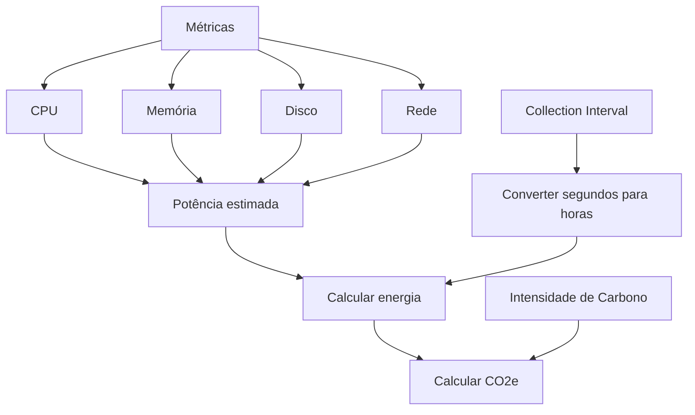

---

# 30. Persistência da Coleta

Depois dos cálculos, o Collection Service envia os dados para o repository.

```text
CollectionService
       ↓
CollectionRepository
       ↓
INSERT
       ↓
PostgreSQL
```

A coleta permanece associada ao serviço correspondente.

Isso permite posteriormente realizar:

- análise histórica;
- gráficos;
- rankings;
- comparações;
- indicadores agregados.

---

# 31. Consulta do Frontend

O frontend não acessa diretamente as APIs externas.

Quando o dashboard precisa dos dados:

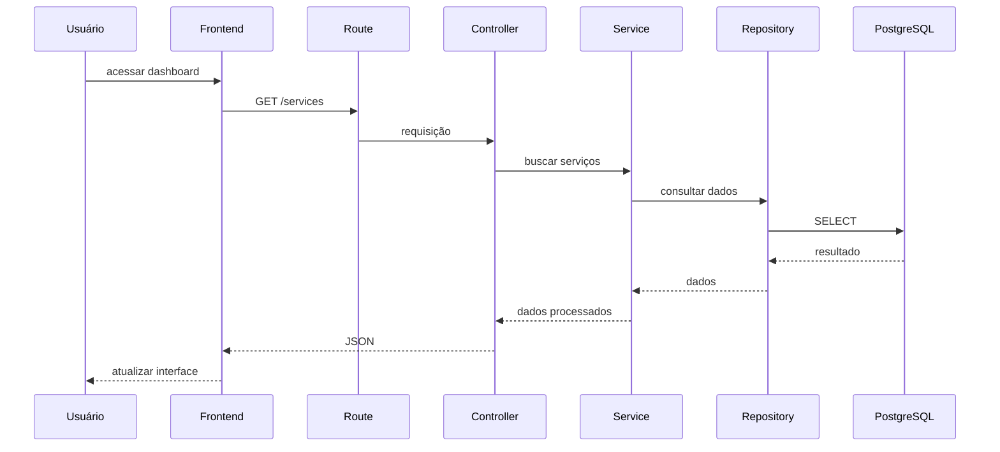

---

# 32. Separação entre Monitoramento e Consulta

O sistema possui dois fluxos principais.

## Fluxo de coleta

```text
Job
 ↓
Service
 ↓
APIs externas
 ↓
cálculos
 ↓
Repository
 ↓
PostgreSQL
```

## Fluxo de consulta

```text
Frontend
 ↓
Route
 ↓
Zod
 ↓
Controller
 ↓
Service
 ↓
Repository
 ↓
PostgreSQL
```

Isso significa que o frontend não precisa esperar uma API externa responder
para visualizar os dados já armazenados.

---

# 33. Atualização do Dashboard

O frontend deve atualizar periodicamente os dados apresentados.

Fluxo:

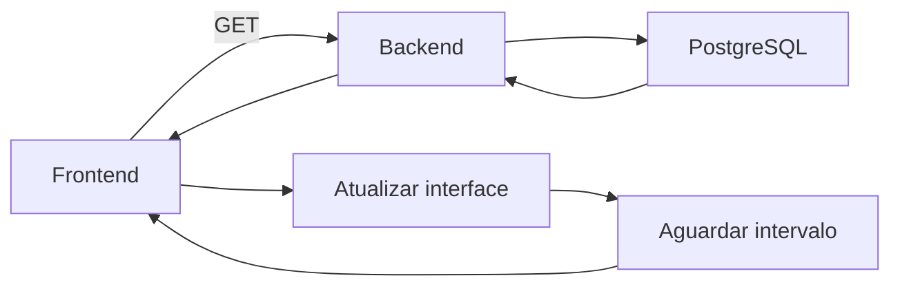

A interface deve exibir a data e a hora da última atualização.

O intervalo do frontend não precisa ser obrigatoriamente igual ao intervalo de
coleta do backend.

---

# 34. Tratamento de Falhas

O GreenER deve continuar funcionando mesmo quando alguma operação individual
falhar.

Possíveis falhas:

```text
API externa indisponível

timeout

serviço removido

serviço indisponível

serviço sem métricas

resposta inválida

falha de validação Zod

falha no banco de dados
```

---

# 35. Fluxo de Tratamento de Falhas

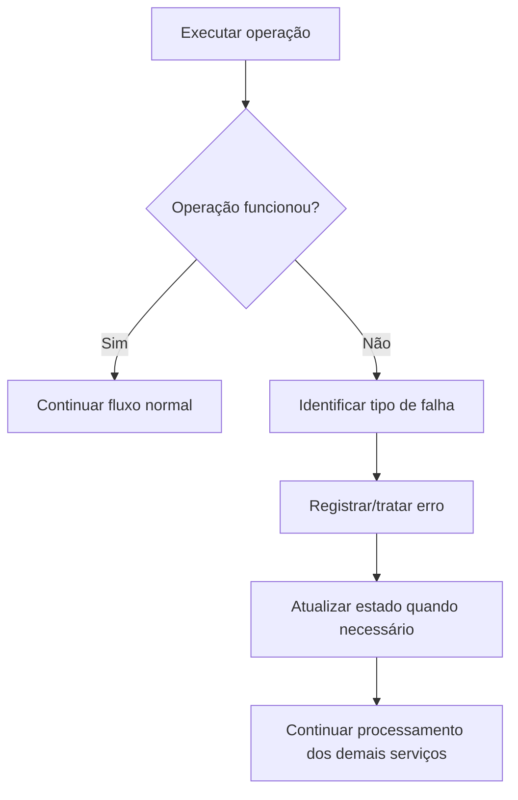

Uma falha em determinado serviço não deve encerrar o monitoramento completo.

---

# 36. Concorrência das Coletas

A arquitetura deve permitir que diferentes serviços sejam coletados sem que um
serviço lento bloqueie necessariamente todos os demais.

Exemplo de uma execução estritamente sequencial:

```text
Serviço A
    ↓
esperar

Serviço B
    ↓
esperar

Serviço C
```

Com timeout de 8 segundos, vários serviços indisponíveis poderiam aumentar
consideravelmente a duração da rodada.

Por esse motivo, a equipe poderá utilizar coleta concorrente.

Exemplo conceitual:

```text
                  ┌── Serviço A
Collection Job ───┼── Serviço B
                  ├── Serviço C
                  └── Serviço D
```

A estratégia específica de concorrência será definida durante a implementação,
considerando simplicidade, estabilidade e o escopo do projeto.

Não é necessário adicionar filas ou sistemas distribuídos para resolver esse
problema inicialmente.

---

# 37. Monitoramento Settings

O módulo `monitoring-settings` é responsável pelas configurações do
monitoramento.

Possíveis configurações:

```text
collection_interval_seconds
```

Fluxo de alteração:

```text
Frontend
    ↓
PATCH /monitoring-settings
    ↓
Route
    ↓
Zod
    ↓
Controller
    ↓
Service
    ↓
Repository
    ↓
PostgreSQL
```

As rotas de configuração protegidas devem utilizar autenticação JWT.

---

# 38. Autenticação

A autenticação da área de configuração é realizada no backend utilizando JWT.

Fluxo simplificado:

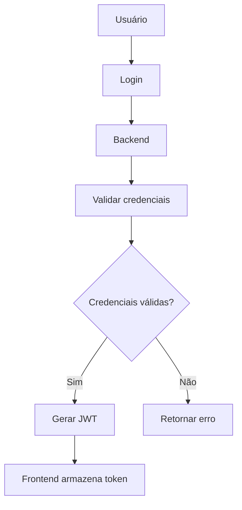

---

# 39. Acesso às Rotas Protegidas

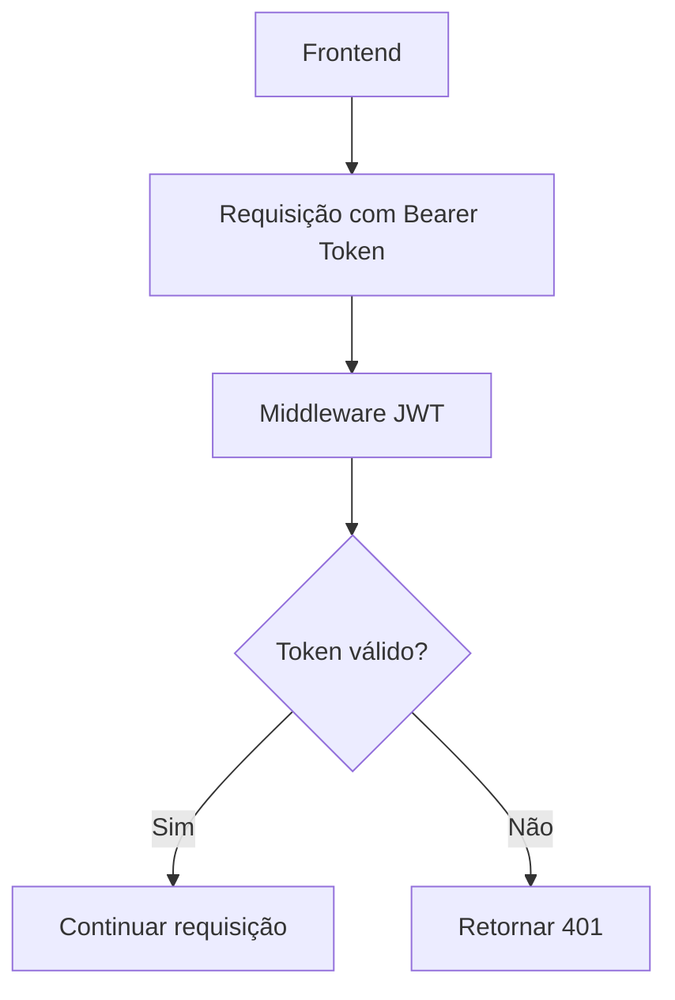

O controle de acesso não deve depender apenas do frontend.

---

# 40. Banco de Dados

O GreenER utiliza PostgreSQL.

A aplicação não utiliza ORM.

O acesso é realizado através do driver:

```text
pg
```

Os comandos SQL são mantidos explicitamente nos repositories.

Exemplo:

```text
Service
 ↓
Repository
 ↓
SQL parametrizado
 ↓
pg
 ↓
PostgreSQL
```

---

# 41. Consultas Parametrizadas

Dados recebidos da aplicação não devem ser concatenados diretamente nas
consultas SQL.

Conceitualmente:

```sql
SELECT *
FROM collections
WHERE service_id = $1;
```

Os valores são enviados separadamente através do driver PostgreSQL.

Isso reduz o risco de SQL Injection e mantém a separação entre comando e dados.

---

# 42. Docker

Toda a aplicação deve ser executável através de containers Docker.

A composição principal possui:

```text
Docker Compose
│
├── frontend
│
├── backend
│
└── PostgreSQL
```

Fluxo:

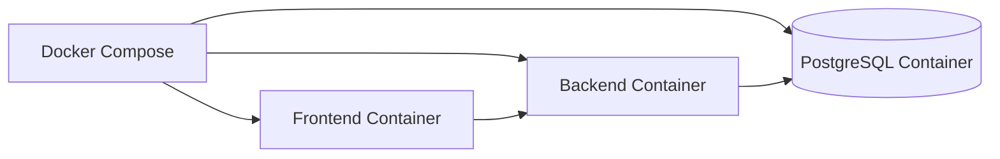

O banco deve utilizar volume persistente para manter os registros mesmo após a
reinicialização dos containers.

---

# 43. Fluxo Completo do GreenER

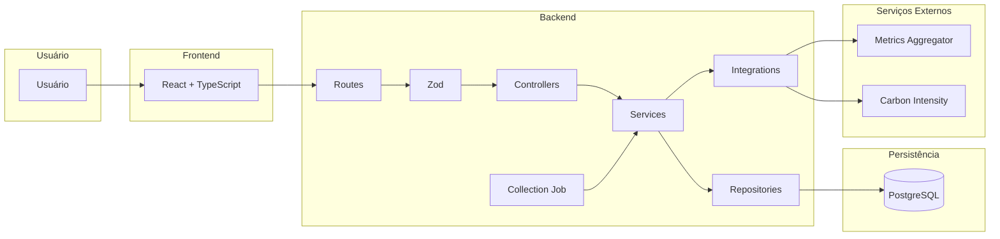

---

# 44. Resumo das Responsabilidades

| Componente | Responsabilidade |
|---|---|
| Frontend | Apresentar informações e permitir interação com o usuário |
| Routes | Definir endpoints HTTP |
| Zod | Validar entradas e dados externos em runtime |
| Controllers | Receber requisições e produzir respostas HTTP |
| Services | Implementar e coordenar regras de negócio |
| Repositories | Concentrar acesso ao PostgreSQL |
| Integrations | Concentrar comunicação com APIs externas |
| Collection Job | Iniciar periodicamente os ciclos de monitoramento |
| PostgreSQL | Persistir serviços, coletas e configurações |
| Metrics API | Fornecer serviços e métricas |
| Carbon API | Fornecer intensidade de carbono |
| JWT Middleware | Proteger endpoints que exigem autenticação |

---

# 45. Decisões Arquiteturais

## 45.1 Backend modular

O backend é organizado em módulos de acordo com os recursos e
responsabilidades da aplicação.

Exemplos:

```text
collections

services

monitoring-settings
```

---

## 45.2 Separação entre Controller e Service

Controllers tratam HTTP.

Services tratam regras de negócio.

Essa separação evita que regras importantes fiquem diretamente ligadas ao
Express.

---

## 45.3 Repository para acesso ao banco

O acesso ao PostgreSQL fica concentrado nos repositories.

Isso permite manter as consultas SQL separadas das regras de negócio.

---

## 45.4 Integration para APIs externas

Chamadas HTTP para sistemas externos ficam concentradas na camada de
`integrations`.

Isso evita duplicação de código e facilita o tratamento de:

- timeout;
- respostas inválidas;
- indisponibilidade;
- mudanças no formato das APIs.

---

## 45.5 Zod para validação runtime

O Zod é utilizado para garantir que dados recebidos externamente possuam o
formato esperado antes de serem utilizados pela aplicação.

O Zod é utilizado tanto nas requisições recebidas pelo GreenER quanto nas
respostas recebidas das APIs auxiliares.

---

## 45.6 Job separado da regra de negócio

O Job é responsável somente pelo agendamento da execução.

A coleta propriamente dita pertence ao Collection Service.

```text
Job
 ↓
Service
```

Isso permite reutilizar o mesmo service independentemente de quem iniciou a
operação.

---

## 45.7 Timeout de 8 segundos

As chamadas externas terão inicialmente timeout de:

```text
8 segundos
```

O valor é uma decisão técnica da equipe e poderá ser revisado durante testes.

---

## 45.8 Persistência histórica

As coletas são armazenadas no PostgreSQL.

Isso permite gerar posteriormente:

- gráficos;
- históricos;
- rankings;
- indicadores consolidados;
- comparação entre serviços.

---

# 46. Classificação das Decisões

É importante diferenciar requisitos obrigatórios de decisões internas da equipe.

## Requisitos obrigatórios do projeto

- React com TypeScript;
- Node.js com TypeScript;
- PostgreSQL;
- SQL explícito;
- sem ORM;
- Docker;
- JWT no backend;
- coleta periódica;
- histórico das coletas;
- tolerância a falhas;
- organização do backend em módulos, controllers e services;
- API HTTP para comunicação com o frontend.

## Decisões técnicas da equipe

- utilização de Express;
- utilização de Zod;
- utilização de `pg`;
- pasta `integrations`;
- pasta `jobs`;
- timeout de 8 segundos;
- armazenamento do intervalo de monitoramento no banco;
- organização interna dos arquivos dos módulos.

## Decisões ainda em aberto

Alguns detalhes poderão ser definidos durante a implementação:

- quantidade de coletas executadas simultaneamente;
- estratégia de concorrência;
- frequência exata do frontend;
- frequência padrão do Job;
- política de novas tentativas em caso de falha;
- estratégia de cache da intensidade de carbono, caso seja necessária.

Essas decisões devem ser tomadas apenas quando houver necessidade real,
evitando adicionar complexidade desnecessária ao projeto.

---

# 47. Arquitetura Resumida

```text
                              USUÁRIO
                                 │
                                 ▼
                    ┌──────────────────────┐
                    │       FRONTEND       │
                    │   React + TypeScript │
                    └──────────┬───────────┘
                               │ HTTP
                               ▼
                    ┌──────────────────────┐
                    │        ROUTES        │
                    └──────────┬───────────┘
                               │
                               ▼
                    ┌──────────────────────┐
                    │         ZOD          │
                    │      Validação       │
                    └──────────┬───────────┘
                               │
                               ▼
                    ┌──────────────────────┐
                    │     CONTROLLERS      │
                    └──────────┬───────────┘
                               │
                               ▼
                    ┌──────────────────────┐
                    │       SERVICES       │
                    │ Regras de negócio    │
                    └─────┬─────────┬──────┘
                          │         │
              ┌───────────┘         └────────────┐
              ▼                                  ▼
    ┌─────────────────────┐           ┌─────────────────────┐
    │    REPOSITORIES     │           │    INTEGRATIONS     │
    │    SQL explícito    │           │ APIs externas       │
    └─────────┬───────────┘           └──────────┬──────────┘
              │                                  │
              ▼                         ┌────────┴─────────┐
        ┌─────────────┐                 ▼                  ▼
        │ PostgreSQL  │           Metrics API        Carbon API
        └─────────────┘


                     COLLECTION JOB
                           │
                           │ inicia periodicamente
                           ▼
                       SERVICES
```

---

# 48. Fluxo Resumido de uma Coleta

```text
Collection Job
      ↓
consultar configurações
      ↓
Collection Service
      ↓
GET /services
      ↓
Zod
      ↓
para cada serviço
      ↓
GET /metrics/{service_id}
      ↓
timeout de 8 segundos
      ↓
Zod
      ↓
obter region_code
      ↓
Carbon API
      ↓
Zod
      ↓
calcular potência
      ↓
calcular energia
      ↓
calcular CO₂e
      ↓
Collection Repository
      ↓
PostgreSQL
```

---

# 49. Objetivo da Arquitetura

A arquitetura proposta busca manter uma separação clara de responsabilidades,
permitindo que cada parte da aplicação tenha um objetivo específico.

O objetivo não é criar o maior número possível de camadas ou abstrações, mas
organizar o sistema de maneira que seja possível compreender:

- quem recebe a requisição;
- quem valida os dados;
- quem executa regras de negócio;
- quem acessa APIs externas;
- quem acessa o banco;
- quem executa as coletas periódicas;
- onde os cálculos ambientais são realizados;
- como os dados chegam até o usuário.

Dessa forma, o GreenER pode evoluir durante as sprints mantendo uma estrutura
compreensível para a equipe.