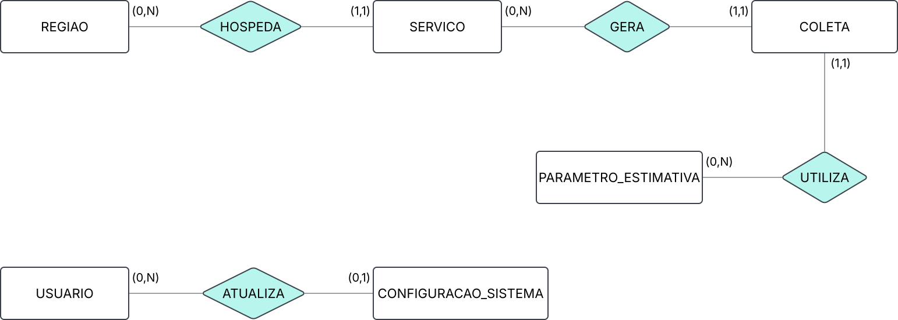
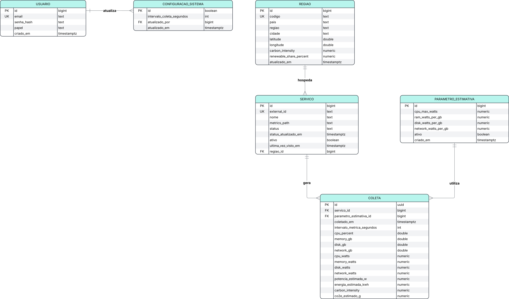

# 🏗️ Arquitetura e Modelagem

Esta seção reúne os artefatos de modelagem de dados desenvolvidos para o projeto **GreenER**.

Os diagramas servem como apoio para análise, implementação e evolução da solução ao longo das sprints, permitindo visualizar as principais entidades, atributos e relacionamentos do banco de dados da plataforma.

Além da visualização em imagem, os diagramas possuem seus respectivos arquivos editáveis no Lucidchart, possibilitando consulta detalhada e navegação pelos elementos modelados.

---

## 🛠️ Ferramenta Utilizada

Ferramenta utilizada para a criação e manutenção dos diagramas do projeto.

Por meio dela são desenvolvidos os diagramas utilizados na documentação da aplicação, permitindo representar visualmente os principais aspectos da solução.

---

## 📋 Diagramas Disponíveis

| Diagrama | Descrição                                                                                                  |
| -------- | ---------------------------------------------------------------------------------------------------------- |
| MER      | Modelo conceitual do banco de dados, com as entidades, seus relacionamentos e cardinalidades               |
| DER      | Modelo lógico do banco de dados, com tabelas, atributos, tipos, chaves primárias e estrangeiras           |

---

# 🧩 Modelo Entidade-Relacionamento (MER)

## Visualização

    

## Arquivo Original

🔗 Lucidchart: [Acessar diagrama](https://lucid.app/lucidchart/a9acb0c6-6bad-4719-8734-a0f1a9c5b4c1/view)

## Objetivo

Representar, em nível conceitual, as entidades do domínio da plataforma GreenER e a forma como elas se relacionam, sem considerar detalhes de implementação como atributos, tipos de dados e chaves estrangeiras. Os atributos de cada entidade são detalhados no DER.

## Notação

- **Retângulo:** entidade.
- **Losango:** relacionamento.
- **(mín, máx):** cardinalidade de cada entidade no relacionamento.

## Entidades

| Entidade               | Descrição                                                                                        |
| ---------------------- | ------------------------------------------------------------------------------------------------ |
| `USUARIO`              | Pessoa com acesso à plataforma, com papel de administrador ou visualizador                       |
| `CONFIGURACAO_SISTEMA` | Configuração global do sistema, como o intervalo de coleta (existe uma única configuração)       |
| `REGIAO`               | Localização geográfica onde os serviços rodam, com intensidade de carbono e percentual renovável |
| `SERVICO`              | Serviço monitorado pela plataforma, com status e caminho de métricas                             |
| `PARAMETRO_ESTIMATIVA` | Coeficientes de potência usados para estimar o consumo de energia                                |
| `COLETA`               | Medição de um serviço em um instante, com consumo de energia e emissão de CO₂e estimados         |

## Relacionamentos

| Relacionamento | Entidades                          | Cardinalidade                                                                                |
| -------------- | ---------------------------------- | -------------------------------------------------------------------------------------------- |
| `HOSPEDA`      | `REGIAO` e `SERVICO`               | Uma região hospeda zero ou muitos serviços; um serviço pertence a uma região                 |
| `GERA`         | `SERVICO` e `COLETA`               | Um serviço gera zero ou muitas coletas; uma coleta pertence a um serviço                     |
| `UTILIZA`      | `PARAMETRO_ESTIMATIVA` e `COLETA`  | Um parâmetro é usado em zero ou muitas coletas; uma coleta usa um parâmetro                  |
| `ATUALIZA`     | `USUARIO` e `CONFIGURACAO_SISTEMA` | Um usuário atualiza zero ou muitas configurações; cada configuração tem no máximo um usuário |

---

# 🗄️ Diagrama Entidade-Relacionamento (DER)

## Visualização

    

## Arquivo Original

🔗 Lucidchart: [Acessar diagrama](https://lucid.app/lucidchart/a428841e-d545-4f2d-b834-a19170ff7bd1/view)

## Objetivo

Representar o modelo lógico do banco de dados PostgreSQL da plataforma GreenER, detalhando as tabelas, os tipos de dados, as chaves primárias (`PK`), as chaves estrangeiras (`FK`) e as restrições de unicidade (`UK`).

## Relacionamentos

| Tabela origem          | Tabela destino         | Chave estrangeira         | Cardinalidade |
| ---------------------- | ---------------------- | ------------------------- | ------------- |
| `regiao`               | `servico`              | `regiao_id`               | 1:N           |
| `servico`              | `coleta`               | `servico_id`              | 1:N           |
| `parametro_estimativa` | `coleta`               | `parametro_estimativa_id` | 1:N           |
| `usuario`              | `configuracao_sistema` | `atualizado_por`          | 0..1:N        |

## Regras de Negócio no Banco

Algumas regras são garantidas pelo próprio banco e não aparecem graficamente no diagrama:

- **Configuração única:** `configuracao_sistema` aceita apenas uma linha (`id BOOLEAN` com `CHECK (id = true)`).
- **Parâmetro ativo único:** índice único parcial em `parametro_estimativa(ativo) WHERE ativo = true`, que permite apenas um conjunto de parâmetros ativo por vez.
- **Coleta única por instante:** `UNIQUE (servico_id, coletado_em)` impede duas coletas do mesmo serviço no mesmo instante.
- **Valores controlados:** `usuario.papel` aceita `admin` ou `visualizador`, e `servico.status` aceita `available`, `metrics_missing` ou `unavailable`.
- **Valores válidos:** `CHECK` impede valores negativos nas métricas e nos cálculos, limita percentuais entre 0 e 100 e limita o intervalo de coleta entre 10 e 3600 segundos.
- **Snapshot de carbono:** `coleta.carbon_intensity` guarda a intensidade de carbono da região no momento da medição, preservando o histórico caso `regiao.carbon_intensity` seja atualizada depois.