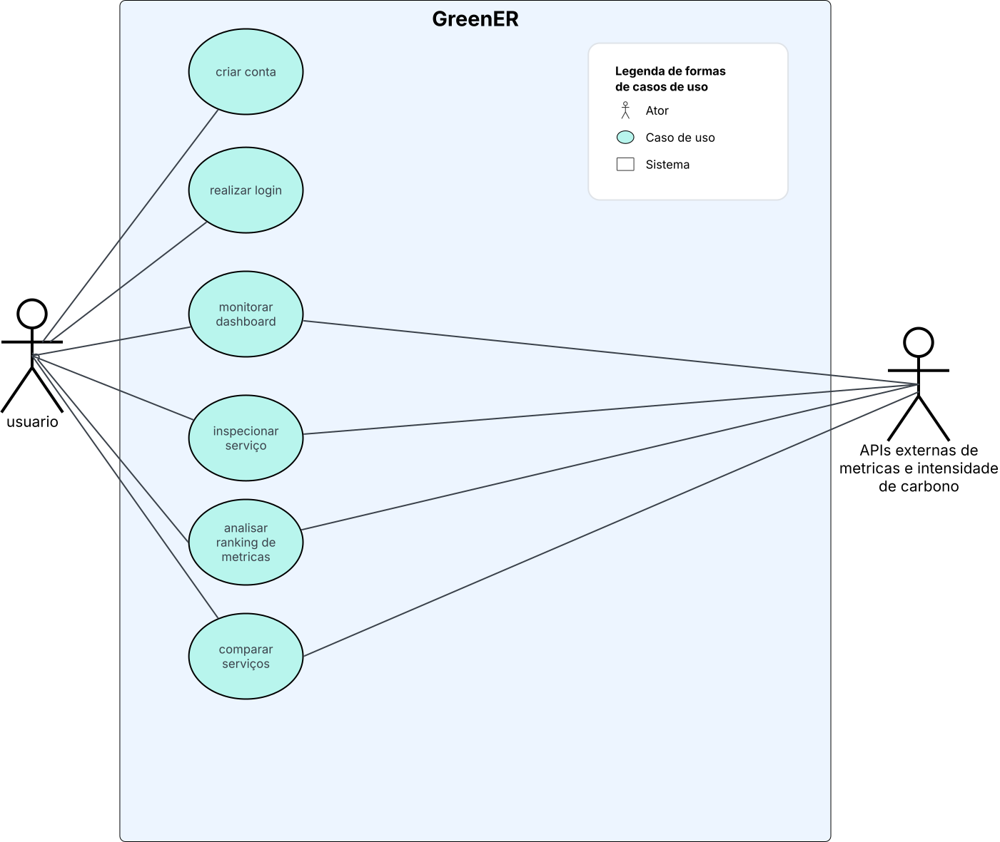
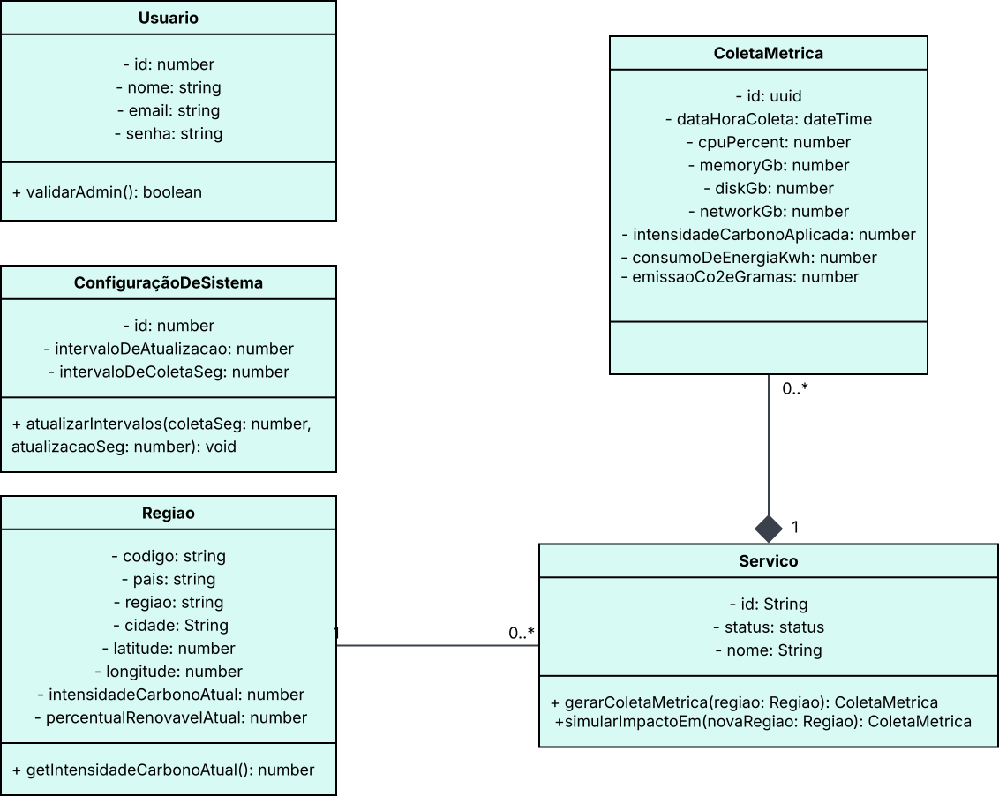

# 🏗️ Arquitetura e Modelagem

Esta seção reúne os artefatos de modelagem desenvolvidos para o projeto **GreenER**.

Os diagramas servem como apoio para análise, implementação e evolução da solução ao longo das sprints, permitindo visualizar os principais elementos e comportamentos da plataforma.

Além da visualização em imagem, os diagramas possuem seus respectivos arquivos editáveis no Lucidchart, possibilitando consulta detalhada e navegação pelos elementos modelados.

---

## 🛠️ Ferramenta Utilizada

Ferramenta utilizada para a criação e manutenção dos diagramas UML do projeto.

Por meio dela são desenvolvidos os diagramas utilizados na documentação da aplicação, permitindo representar visualmente os principais aspectos da solução.

---

## 📋 Diagramas Disponíveis

| Diagrama      | Descrição                                                                                   |
| ------------- | ------------------------------------------------------------------------------------------- |
| Caso de Uso   | Representa os atores envolvidos e os principais objetivos disponíveis na plataforma         |
| Classes       | Representa a estrutura do sistema, suas entidades, atributos, métodos e relacionamentos     |

---

# 🎯 Diagrama de Caso de Uso

## Visualização

    

## Arquivo Original

🔗 Lucidchart: [Acessar diagrama](https://lucid.app/lucidchart/547778f4-32b2-4cc9-9630-ae5ce0b6e4be/view)

## Objetivo

Representar os atores envolvidos no sistema e os principais objetivos que podem ser realizados dentro da plataforma GreenER.

---

# 🧩 Diagrama de Classes

## Visualização

    

## Arquivo Original

🔗 Lucidchart: [Acessar diagrama](https://lucid.app/lucidchart/37acad31-54dc-4cac-aff9-a3d7c1721d7a/view)

## Objetivo

Representar a estrutura estática do sistema, evidenciando as principais entidades do domínio, seus atributos, métodos e relacionamentos, servindo como base para implementação e evolução da aplicação.